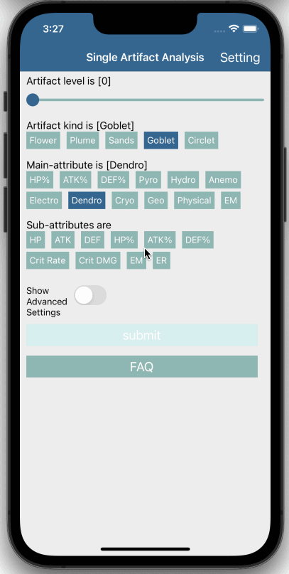

# Dottore (Genshin Artifact Deep Analyser)

## Introduction

### Current Features

- Use only sliders and buttons to input the artifact information, free from mobile keyboard
- Deep analysis of an artifact on submission:
  - The rarity of an artifact **considering the rarity of its main-attribute and sub-attributes**
  - Expected&Extreme score of the artifact at max-level based on its current sub-attributes
- **User can define the weights** of attributes or use one of the pre-defined ones
- Supports English and 简体中文

### Future Features

- More analysis:
  - Probability for an artifact to reach a certain score or rarity
- Support more languages (if anyone volunteers to translate)
- Take photo and AI scan the artifact attributes (may take a long time to develope)
- ...

## Install and FAQ

### Install

[Android Link](https://github.com/Jarvis-Yu/Dottore-Genshin_Artifact_Deep_Analyser/releases/download/v1.0-beta.2/Dottore_beta_2.apk)

### Supported Platforms?

Both `android` and `ios` are supported, but currently I don't want to pay the money to publish the app on App Store.
So for the foreseeable future, only `android apk` will be released.

### Supported Languages?

- English
- 简体中文
- 日本語 (if anyone volunteers to translate for me)

## Contact

Please contact me if you have any questions, suggestions or interested in joining in.

- Email: JarvisYu_Pro@outlook.com
